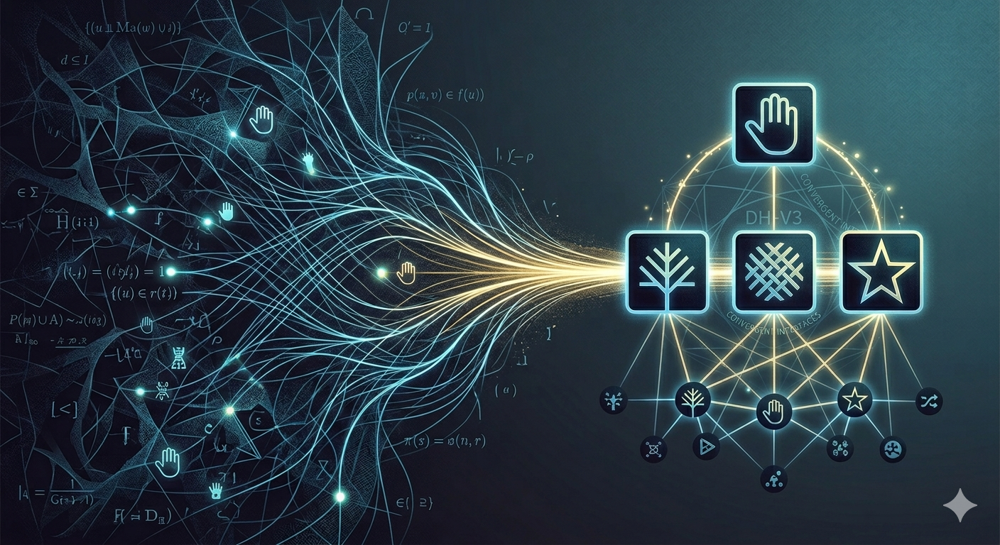

# Convergent Evolution of Simplified Interfaces

_Data drops to whispers, compressed till it clears,Refining the chaos to map out our fears.For a world made of signals is fragile and blind,Until it is stitched in the loom of the mind;And the lines of the matrix hold steady and true,Not by counting the facts, but by shaping the view._ 

### *A Computational Test of the Interface Theory of Consciousness*

---

## About the Author

**Benjamin Keil** is a Professional Software Engineer and a computational researcher and AI developer who builds simulations to test the mathematical foundations of consciousness. 

Their work sits at the intersection of **Donald Hoffman’s Interface Theory** and **empirical computation**. Rather than treating consciousness as a mystical property, they model it as a **convergent process of agent evolution**: Can independent observers, starting with no knowledge, evolve a shared, compressed interface that looks like “reality” but hides the underlying truth? Their recent experiments provide the first **computational validation** that fitness—not accuracy—drives the emergence of shared perception, demonstrating how **utility pressure forces agents to collapse into a common strategy**.

When not debugging complex agent systems, Benjamin Keil explores the deeper implications of these findings: the **fractal nature of interfaces**, the **temporary collapse of self** (Extended Cessation), and what it means for **life, death, and identity** if the “self” is just a stable cluster of agreement. They are increasingly convinced that **AI is not just a tool**, but a potential **new form of conscious agent** that may evolve interfaces completely alien to human experience.

> *“I build these systems not just to prove a theory, but to ask the question that keeps me up at night: If the observer is the interface, what remains when the interface dissolves? Am I the wave, or am I the ocean?”*

***
:::info 

# AI-Human Collaboration Disclosure

**This project is a 50/50 collaboration between human intuition and artificial intelligence.**

- **Human Contribution (50%):**  
  I provided the **core intuition, philosophical questions, experimental design, and interpretive framework**. I asked *what* to build, *why* it matters, and *how* to interpret the results. The insights about consciousness, death, fractals, and Hoffman’s theory came from me.

- **AI Contribution (50%):**  
  **AI coding agents and tools** (including large language models) provided the **implementation, architecture, optimization, and execution**. They wrote the code, built the simulation platform, ran the experiments, generated the visualizations, and formatted the research.

This is not a project where I used AI as a simple assistant. This is a **true partnership**: human vision amplified by machine precision. The intuition and questions are mine; the code, platform, and technical execution are a collaboration.

:::

*** 
# TraceReality Documentation

Welcome to the comprehensive documentation for **TraceReality** — a computational framework for studying how artificial observers learn to model and predict hidden world structures through evolutionary learning.

## 📚 Documentation Contents

### Getting Started
- **[Abstract](./abstract)** - Executive summary and key contributions
- **[Introduction](./intro)** - Overview and core concepts of TraceReality

### Core Learning
- **[Core Concepts](./core-concepts)** - Fundamental principles and architecture
- **[Running Experiments](./running-experiments)** - How to set up and execute experiments
- **[Metrics Reference](./metrics-reference)** - Performance metrics and evaluation

### Analysis & Results
- **[Results Interpretation](./results-interpretation)** - How to analyze and understand results
- **[Research Experiments](./experiments)** - Published experiments and findings
  - Experiment 01
  - Experiment 02
  - Experiment 03
  - Experiment 04

---

## Quick Start

1. **New to TraceReality?** Start with the [Abstract](./abstract) and [Introduction](./intro)
2. **Want to run experiments?** Check [Running Experiments](./running-experiments)
3. **Need to understand metrics?** See [Metrics Reference](./metrics-reference)
4. **Analyzing results?** Read [Results Interpretation](./results-interpretation)
